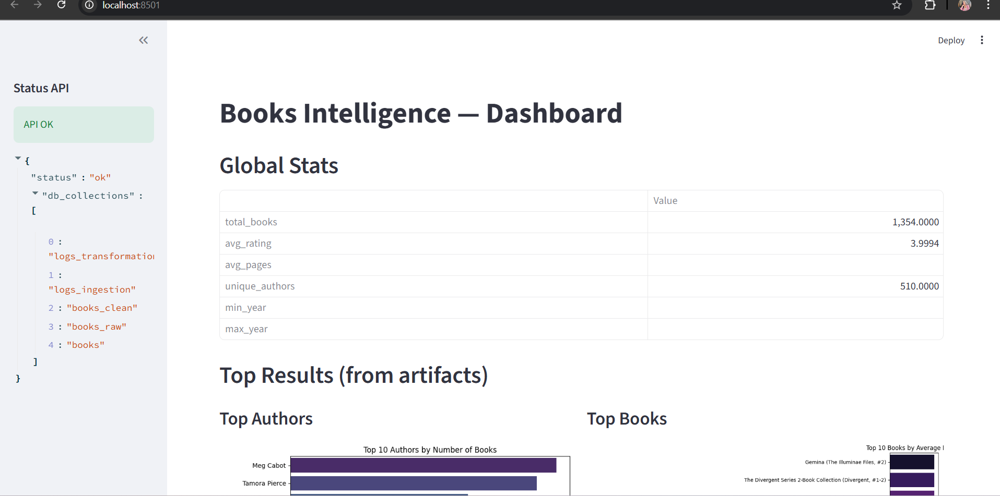
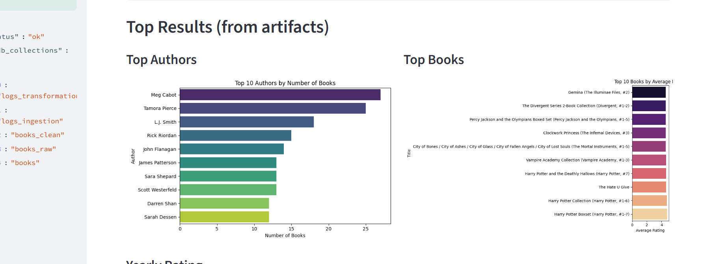
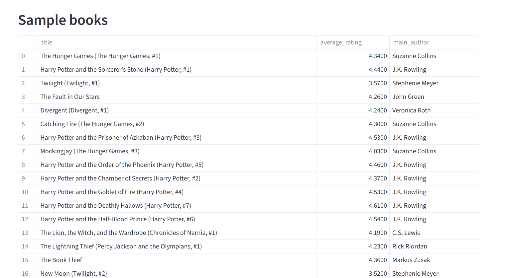

# 🎯 **Projet Big Data – Pipeline complet (ETL • API • Dashboard • Analytics • ML)**

# 📘 **Présentation du projet**

Ce projet met en place un **pipeline Big Data complet** permettant :

* 📥 **Ingestion** de données livres (CSV → MongoDB)
* 🧹 **Nettoyage et transformation** (Quality checks, enrichissement)
* 📊 **Analyse statistique** + génération de graphiques
* 🔌 **API REST FastAPI**
* 📈 **Dashboard interactif Streamlit**
* 🤖 **Machine Learning** (modèle prédictif)
* 📦 **Export des résultats** dans un dossier `artifacts/`


---

# 🏗️ **Architecture globale**

```
                   ┌──────────────────────────┐
                   │        Dataset CSV        │
                   │      (books_raw.csv)      │
                   └───────────────┬───────────┘
                                   │
                        📥 Ingestion (Python)
                                   │
                                   ▼
                 ┌────────────────────────────┐
                 │        MongoDB Atlas        │
                 │  (stockage + logs ingestion)│
                 └───────────────┬────────────┘
                                   │
                          🧹 Transformation
                                   │
                                   ▼
                data/books_clean.csv (dataset propre)
                                   │
                                   ▼
                     📊 Analyse & Visualisation
        (top books, top authors, yearly rating, stats globales)
                                   │
                                   ▼
                       🤖 Machine Learning
          RandomForest → modèle.pkl + métriques d’entraînement
                                   │
                                   ▼
                       📦 artifacts/ (outputs)
                                   │
             ┌────────────────────────────────────┐
             │                    │                │
             ▼                    ▼                ▼
       🔌 API FastAPI      📈 Dashboard Streamlit   CSV/PNG
```

---

# 📂 **Structure du projet**

```
TP_bigdata/
│── README.md
│── requirements.txt
│── artifacts/               # Graphiques, CSV, modèle ML
│── data/
│   ├── books_raw.csv
│   └── books_clean.csv
│
│── src/
│   ├── ingestion/
│   │   └── ingest_books.py
│   ├── transformation/
│   │   └── clean_books.py
│   ├── analytics/
│   │   └── analyze_books.py
│   ├── api/
│   │   └── app.py
│   └── dashboard/
│       └── app.py
```

---

# ⚙️ **Installation**

### 1. Cloner et activer l’environnement

```bash
git clone https://github.com/eya/Projet_bigdata.git
cd Projet_bigdata
python -m venv .venv
.venv\Scripts\activate
```

### 2. Installer les dépendances

```bash
pip install -r requirements.txt
```

---

# 1️⃣ **Ingestion des données**

```bash
python src/ingestion/ingest_books.py
```

* Lecture du fichier brut
* Enregistrement dans MongoDB
* Log d’ingestion

---

# 2️⃣ **Transformation & Nettoyage**

```bash
python src/transformation/clean_books.py
```

* Nettoyage intelligent des données
* Enrichissement (scores, valeurs dérivées)
* Gestion des valeurs manquantes
* Export → `data/books_clean.csv`

---

# 3️⃣ **Analyse et visualisation**

```bash
python src/analytics/analyze_books.py
```

Génère automatiquement :

📌 statistiques globales
📌 top livres
📌 top auteurs
📌 évolution du rating par année
📌 graphiques (PNG)
📌 CSV d'analyse
📌 modèle ML → `artifacts/model.pkl`

---

# 4️⃣ **API FastAPI**

### Lancer l'API

```bash
uvicorn src.api.app:app --reload --port 8000
```

Endpoints disponibles :

| Endpoint         | Description               |
| ---------------- | ------------------------- |
| `/health`        | Vérifier l'état de l'API  |
| `/collections`   | Liste MongoDB             |
| `/top-books`     | Top 10                    |
| `/top-authors`   | Classement auteurs        |
| `/yearly-rating` | Évolution                 |
| `/predict`       | ML : Prédiction du rating |

---

# 5️⃣ **Dashboard (Streamlit)**

### Lancer le dashboard :

```bash
streamlit run src/dashboard/app.py
```

Fonctionnalités :

* 📊 statistiques globales
* 🏆 top books / top authors
* 📈 graphiques déjà générés
* 🤖 prédictions ML
* 🔌 communication automatique avec l’API

### Configuration optionnelle (`secrets.toml`)

```
~/.streamlit/secrets.toml
```

```toml
API_BASE = "http://127.0.0.1:8000"
```

---

# 🤖 **Machine Learning**

Modèle utilisé :
➡️ **RandomForestRegressor**

Objectif :
📌 prédire le `average_rating` à partir de :

* num_pages
* ratings_count
* text_reviews_count
* popularity_score

Résultats exportés dans :

```
artifacts/model.pkl
```

---

# 🧪 **Tests rapides**

### API

[http://127.0.0.1:8000/health](http://127.0.0.1:8000/health)

### Dashboard

[http://localhost:8501](http://localhost:8501)

---





# 🏁 Conclusion 

Ce projet illustre la mise en place d’un **pipeline Big Data complet**, depuis la collecte des données jusqu’à leur exploitation via une API et un dashboard interactif.
Il démontre :

* la maîtrise de l'ingestion et de la gestion de données volumineuses
* l’application de techniques de **data cleaning** et de transformation
* la capacité à produire des analyses statistiques automatisées
* la création d'une API performante (FastAPI)
* l'intégration dans un dashboard professionnel (Streamlit)
* l’entraînement d’un modèle Machine Learning intégré au pipeline

➡️ Ce projet reflète une architecture **réaliste et opérationnelle**, similaire à ce qui est utilisé dans les entreprises data-driven.

---

