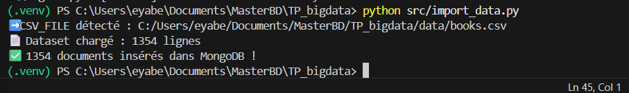
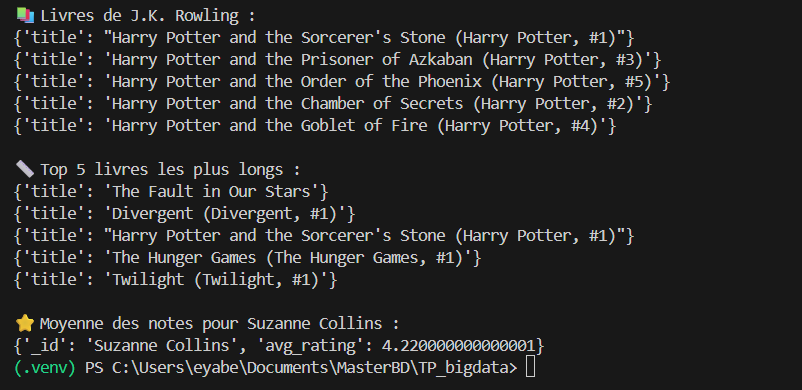

# 📚 Projet Big Data – MongoDB & Python

Ce projet consiste à manipuler un dataset de livres, à l’ingérer dans MongoDB et à effectuer plusieurs requêtes d’analyse grâce à Python.

## 🚀 1. Pré-requis

### Technologies utilisées

* Python 3.10+
* MongoDB Atlas
* Pandas
* Pymongo
* python-dotenv
* VS Code

### Installation des dépendances

```bash
pip install -r requirements.txt
```

---

## 📁 2. Structure du projet

```
TP_bigdata/
│── data/
│   └── books.csv
│── src/
│   ├── import_data.py
│   └── main.py
│── .env
│── .gitignore
│── README.md
│── requirements.txt
```

---

## 🔐 3. Configuration (.env)

Créer un fichier `.env` à la racine :

```
MONGO_URI=mongodb+srv://<user>:<password>@cluster0.mongodb.net/
DB_NAME=books_db
COLLECTION_NAME=books
CSV_FILE=C:/Users/eyabe/Documents/MasterBD/TP_bigdata/data/books.csv
```

---

## 📥 4. Importation des données vers MongoDB

Lancer le script d'import :

```bash
python src/import_data.py
```

Exemple de résultat attendu :

```
➡️ CSV_FILE détecté : data/books.csv
📄 Dataset chargé : 1354 lignes
✅ 1354 documents insérés dans MongoDB !
```

---

## 🔎 5. Analyses & Requêtes (main.py)

Lancer :

```bash
python src/main.py
```

Ce script exécute plusieurs traitements :

### ✔️ 1. Affiche quelques documents

### ✔️ 2. Top 10 livres les mieux notés

### ✔️ 3. Nombre de livres par langue

### ✔️ 4. Livres d’un auteur spécifique (ex : J.K. Rowling)

### ✔️ 5. Top 5 des livres les plus longs

### ✔️ 6. Moyenne des notes d’un auteur

## 📸 Importation des données dans MongoDB


## 📊 Résultat après import


## 🔍 Exemples de documents affichés


## ⭐ Statistiques extraites (Top Rating, Langues…)



## 🧠 6. Ce que j’ai appris

* Manipulation d’une base NoSQL MongoDB
* Création d’un cluster MongoDB Atlas
* Importation massive de données (`insert_many`)
* Requêtes avancées : tri, filtrage, agrégations
* Construction d’un mini pipeline Python → MongoDB → Analyse
